Note: This is my attempt on a worklog on running program-search experiments against published benchmarks, using a program-search library called [cadence](https://github.com/yash-srivastava19/cadence) that I wrote.

# The Harness Was the Experiment

AlphaEvolve gave the world a genuinely powerful general-purpose discovery and optimization agent, and cadence is my attempt to bring that logic to solve real world problems. [cadence](https://github.com/yash-srivastava19/cadence) evolves code you can measure. You bring a program, a scoring verifier, and a sandbox where you can run the candidate. It proposes a change, applies it as a diff, measures the candidate, keeps what improved, and iterates from the best evidence so far. I've [written about the design before on travelling salesman problem](https://yash-sri.xyz/blog/cadence_blog) and now want to extend it to better and harder problems - with huge improvements in the library as well.

Only constraint here is that I am compute poor, and I am running on a single machine. Local models were too large to run efficiently, and the proprietary models did not have generous free tiers to run the experiments in one long duration, so I did what any sane person would do, work around that constraint and make cadence's design to accommodate for that. Over the course of this blog, I will try to explain the design decisions behind cadence and how it compares to existing tools currently in the market. On a high level, the diagram explains what cadence does.

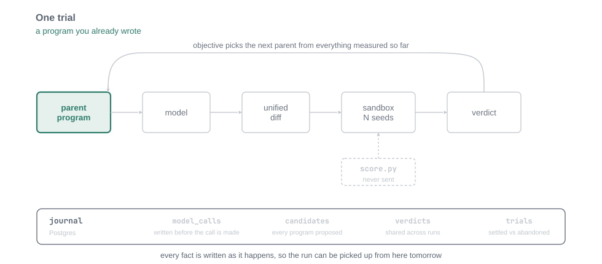

*One trial, stepped through. The model only ever sees the marked region; `score.py` sits outside it and is never sent, so a candidate cannot mark its own work. Watch the row along the bottom: each fact is written as it happens, which is what makes the run resumable tomorrow.*

## Rome wasn't built in a day

If we look at the problems(hard combinatorial problems, chip design, mathematical and algorithmic problems) a discovery agent has to find solutions for, it becomes very clear that it is not a task that can be just done in one day unless you are not compute limited. An experiment can span multiple days and sessions, and if a run has to span days, the experiment should be able to resume from where it left off, and that is the first thing I built in cadence - **resumability** and **replayability**.

One important design decision here is that cadence doesn't make any assumptions about the problems it used to solve for, so all failure scenarios considered should be problem agnostic. An experiment can run in one minute, one hour or day, and it can get OOMed and can be run across multiple machine, with our without GPU, it could be an ML problem, a math problem or an algorithmic one  - all those decisions are strictly kept away from the main runtime of cadence. From a design point of view, cadence abstracts away all those failure modes from the user, and provides a clean interface so experiments are deterministic, reproducible and can run anywhere. All data for an experiment, trial, and run is stored in the database(which you bring), so there is no lock in as well.

The idea with cadence is simple - anyone can conduct experiments on their own and algorithms, store in their own database and benchmark to produce novel solution to hard problems. When you are compute constrained, every model call is precious, and we should not waste it.

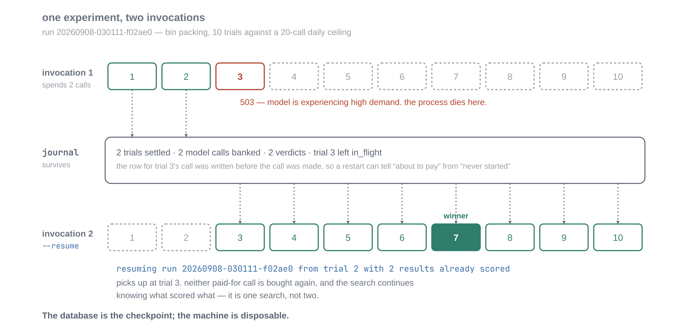
*See the third row: invocation 2 is not a new experiment that happens to start from a good program. It is the same search, with the same measured history, continuing.*

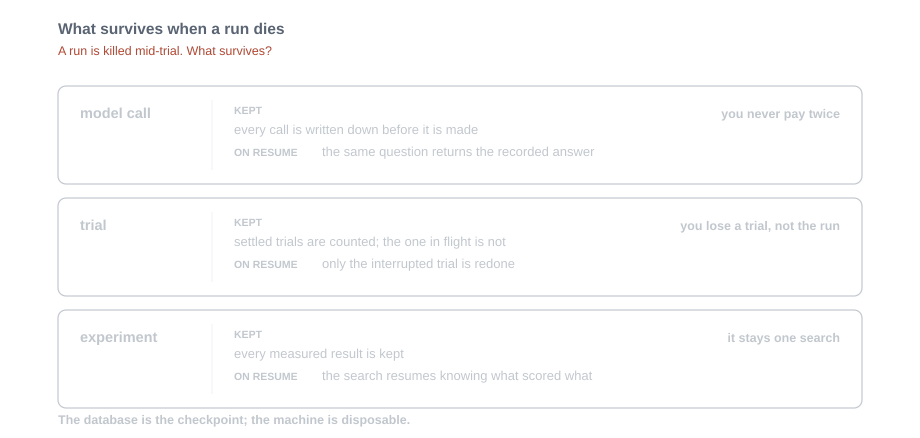
*What survives a kill, and why each level matters separately.*

One a side note, resume works not only at model call level - but at three different levels, and they all do different jobs. At the **model call** level, a redone trial asking the same question gets handed the recorded answer instead of requesting it again(the model call output is content addressable). At the **trial** level, resume counts settled trials and renumbers from there, so only the one in flight is redone. At the **experiment** level, the full history of measured results comes back, so the search carries on knowing what scored what. Distinction between all the entities and how they contribute to the main runtime of cadence needs a separate blog altogether.

Folks familiar with ML model training can draw parallels between the database-backed resume and the model checkpointing. The third is the one that makes multi-day runs worth doing without using hacky techniques(or just increasing the compute budget). Reading a run back out of Postgres returns the same experiment history the loop has built in memory - the database is the checkpoint; the machine is disposable. Cadence is built in a general purpose fashion, and many of the smaller decisions that earn their place are baked into the framework and would need a separate blog on their own.

I can't just make bold claims about the library without taking it for a run, so below are some benchmarks on how cadence performs on some interesting problems with respect to published numbers.

## Circle Packing

Pack 26 circles into a unit square and maximise the sum of their radii. The seed program puts 26 identical circles on a 6×6 grid and scores 2.166667.

One important detail to keep in mind is that the harness should be equal or more powerful than the model itself. The first two runs for this problem produced six candidates between 1.489 and 1.772 - significantly worse than the baseline. Every one was worse than the grid. Six failures in a row is not ambiguous, and I spent two days believing the search didn't work.

After a rather long debugging session, the root cause of it was the sandbox where the program was running. Candidates were being killed at thirty seconds and scored on whatever half-converged state they had reached, because the model writes long optimisers and those have no meaningful intermediate value. A second limit was doing the same thing to the model: Gemini's provider row capped calls at 120 seconds against cadence's own default of 300, and both runs had ended timeout, which I had thought was because the runtime didn't work.

*On a side note, I did anticipate these kind of problems when designing cadence, so I took design inspiration from one piece of software I really like - kubernetes. Cadence is designed so every configuration regarding your problem is checked in as a manifest. All problem configuration such as timeout, memory constraints, scoring objective and strategy are defined upfront in a manifest file and cadence parses and tailors it for the problem at hand. The core promise between kubernetes and cadence is also similar - scalability and disaster recovery. I would like to think of cadence as LLM problem discovery orchestrator*.

Coming back, those numbers from the initial run were never measuring the search. They were measuring how much of it fits in thirty seconds.

With both limits raised the run started producing, and it has been producing ever since — across three separate days, with a cap of 20 requests a day provided by Gemini free tier.

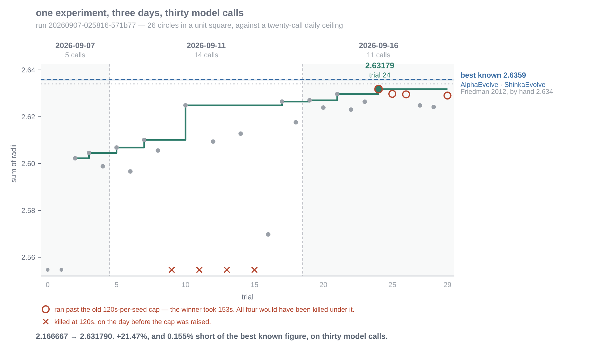
*One run id, thirty model calls, three sittings. The step line is the best program so far; grey dots are individual trials. The two things to look at are the day boundaries — no single day could have bought this — and the circled trials, which ran longer per seed than the sandbox cap that was in force the day before.*

**2.166667 → 2.631790.** A 21.47% improvement on the seed, and 0.155% short of the best known figure.

I pulled the winner out of the database with `cadence apply`, scored it in a fresh directory it had never run in, and got 2.629627, 2.630866 and 2.634877 across the three seeds. Mean 2.631790, matching the recorded verdict to six decimals, with the overlap and containment checks passing on every one. The packing is real.

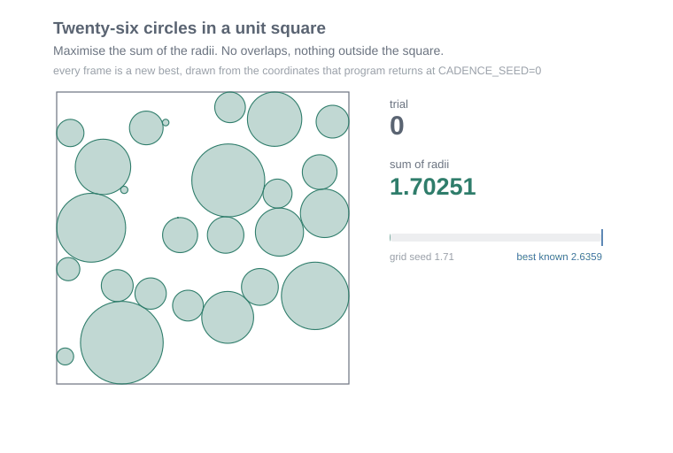
*Every frame is a trial that set a new best, drawn from the coordinates that program actually returns. The grid gives way to mixed sizes: large circles through the middle, small ones wedged against the edges. Selection used the mean of three seeds, which is why the last frame is not the highest at this one.*

Here is where that lands against the published work.

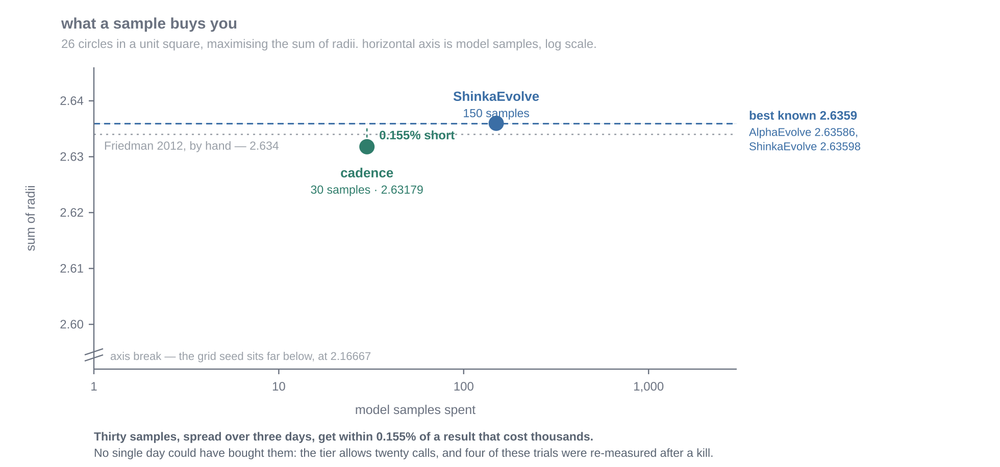

*The y-axis spans five hundredths of a unit; the x-axis spans three orders of magnitude. That asymmetry is the whole picture. The best known value is 2.6359 — AlphaEvolve's 2.63586, then ShinkaEvolve's 2.63598 — and before either of them it was 2.634, found by hand and recorded on [Erich Friedman's packing pages](https://erich-friedman.github.io/packing/), which have been accumulating at Stetson since the nineties.*

The gap that remains is four thousandths of a unit. With cadence, I can resume the training at anytime and try to close the gap. This is the power of resumability.

### What it ended up building

The final program does something the early winners did not. Instead of moving circles and radii together by gradient descent, it splits the problem: given fixed centres, the best possible radii are the solution to a linear program, so it solves that exactly with a primal simplex method, then uses the LP's dual shadow prices as the gradient for moving the centres. Adam, basin-hopping on the smallest circles, and a pattern search run on top of that.

That is a change of formulation rather than a tuning of constants, and it is the category [Pelleriti et al.](https://arxiv.org/abs/2605.20086) found evolutionary agents produce rarely — most edits are hyperparameter changes, and the architectural ones are both scarce and responsible for most of the gain. It arrived on the twenty-fifth call.

## Bin Packing Problem

Circle packing had a limitation I couldn't argue away: the baseline was mine. A 6×6 grid scoring 2.16667 is a number nobody has published, so if my harness had been subtly wrong, nothing in the experiment would have objected. Act I is a fair assessment of how much I should trust my own judgement here.

So I went looking for a problem whose baseline was somebody else's, and ideally one I could run rather than quote.

Online bin packing is that problem. Items arrive one at a time, each is placed on arrival and never moved, and you want to use as few bins as possible.

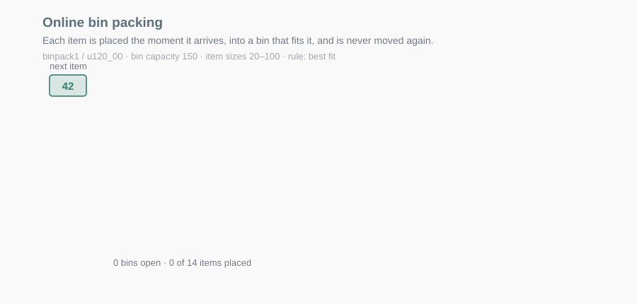
*Real items from `binpack1`, placed by best fit as they arrive. Watch the numbers above each bin: they are the room left. Three bins finish on 1, 15 and 18 — and since no item is smaller than 20, that space is gone for good. That waste is what the rest of this section is about.*

It is one of the oldest benchmarks in combinatorial optimisation, and the analysis is settled in a way ML benchmarks never are. [David Johnson's 1973 MIT thesis](https://en.wikipedia.org/wiki/David_S._Johnson) showed that first fit and best fit both have an asymptotic worst-case ratio of 1.7, and that sorting the items first gets you to 11/9·OPT + 4.

The test instances are `binpack1` through `binpack4` from [OR-Library](https://people.brunel.ac.uk/~mastjjb/jeb/info.html), which J.E. Beasley assembled in 1990 and described in a paper titled *Distributing test problems by electronic mail*. Twenty instances each at 120, 250, 500 and 1000 items, sizes uniform on [20, 100], capacity 150. The metric is the percentage of bins beyond Martello and Toth's L2 lower bound, from *Knapsack Problems* (Wiley, 1990).

### The result

Ten trials, ten model calls, gemini-3.6-flash, about twenty minutes.

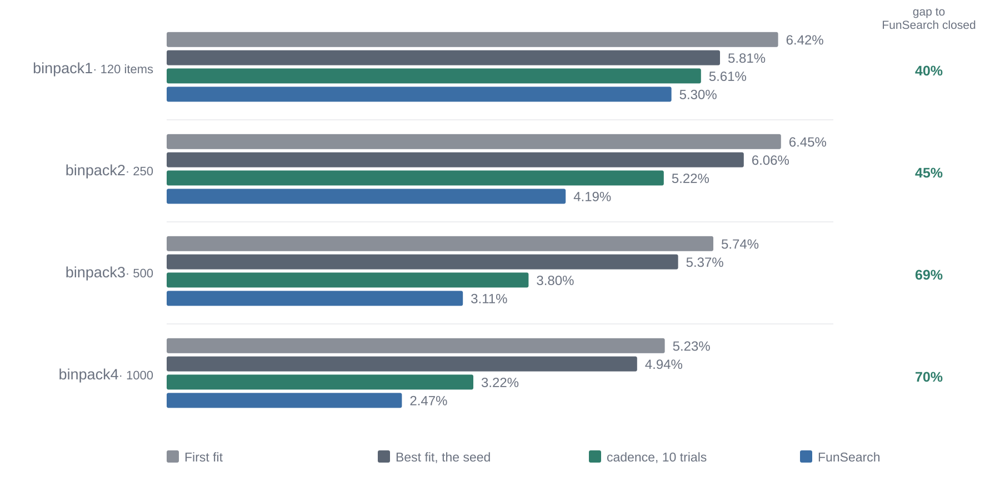
*Percentage of bins beyond the L2 bound; lower is better. The two baseline rows are my own reproduction, matching Table 1 to every decimal the paper prints. FunSearch's row is quoted, not reproduced — I checked its binpack2/3/4 figures against secondary literature but not binpack1's 5.30.*

It beats best fit on all four held-out sets, closing 40, 45, 69 and 70 percent of the distance from best fit to FunSearch as instances get larger. On binpack4 it wins all twenty instances.

### What it built, and who built it

Item sizes here run from 20 to 100 and bins hold 150. So a bin with 19 units left is finished — nothing that can still arrive will fit. Nineteen units of capacity that will never hold anything again.

Best fit doesn't know that. It puts each item in the tightest bin that fits and will happily leave twelve units behind. The winner is built entirely around not doing that:

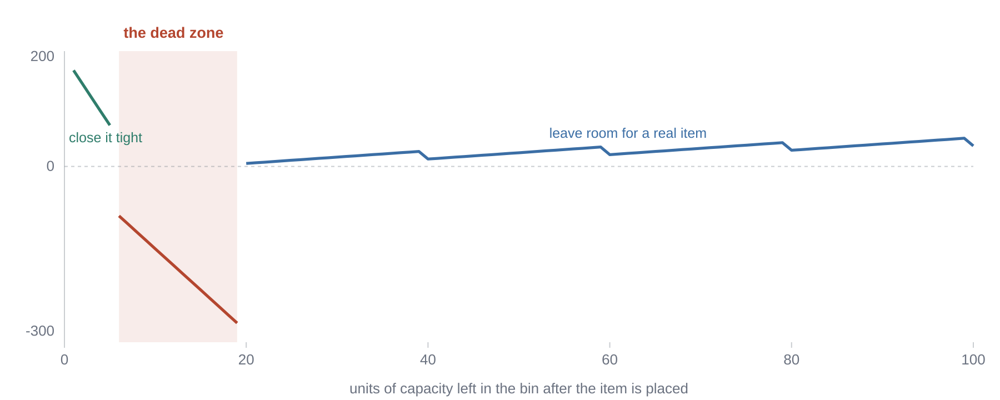
*The winner's score for a bin against the room left after the item goes in, at item size 50. Close the bin tight (1–5 left) or leave room for a real item (20+, rising in steps of 20), but never stop in between. An exact fit scores 100,000, three orders of magnitude off the top.*

```python
return [
    100000.0 if (rem := left - item) == 0 else (
        200.0 - rem * 25.0 if rem <= 5 else (
            -15.0 * rem if rem < 20 else (
                -0.8 * rem + 2.0 * (rem % 20) + 25.0 * (rem // 20) - 0.05 * left
            )
        )
    )
    for left in bins
]
```

The mechanism is measurable. Across binpack4's twenty instances the winner uses 8,269 bins to best fit's 8,407 and closes 1,748 bins exactly to best fit's 1,350. The number that explains both: it strands 32,247 units in dead-zone bins where best fit strands 53,760. It does not avoid creating dead-zone bins. It wastes forty percent less inside the ones it creates.

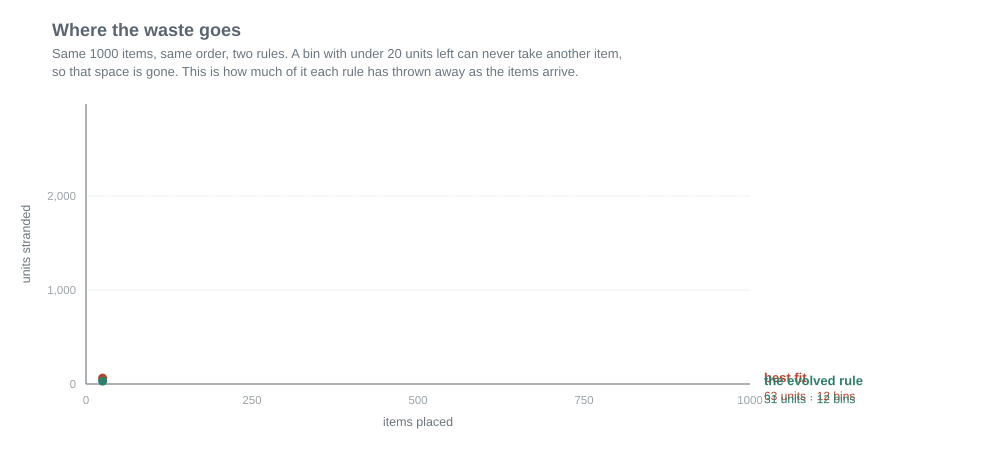
*One 1000-item instance, both rules fed the same arrivals in the same order. Best fit ends having thrown away 2,757 units of capacity that can never be used again; the evolved rule throws away 1,601, and uses seven fewer bins. On a 120-item instance this gap is small enough to vanish, which is exactly why the win shows up on the large sets and not the small ones.*


cadence also provides a way to add other domain specific information about the problem in a `IMPOROVE.md` file. This allows us to steer candidate generation in a particular direction. This is send with every prompt. In case of bin packing, it contained this line:

> Item sizes are integers between 20 and 100. Bin capacity is 150. So a bin with less than 20 left can never take another item.

What the model did on top of that is its own, and I don't want to flatten that either. The four regimes are its idea, as are the tiering by `rem // 20`, the `+2.0 * (rem % 20)` term preferring headroom inside a tier, and the exact-fit score pushed clear of everything else. Best fit got the identical guidance file and does none of it.

But the honest description is that a well-specified problem statement bought most of the result. That's a better finding than the alternative.

### The generalisation runs the right way

It was evolved on generated instances of 120 items and never saw OR-Library.

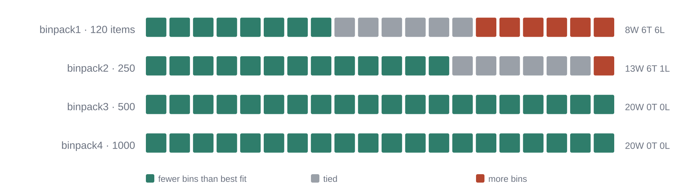
*Per-instance record against best fit. At its training size it is close to a coin flip. At four and eight times that size it does not lose once.*

At 120 items it goes 8-6-6, and the aggregate 5.61% against best fit's 5.81% conceals that completely. At 500 and 1000 items it wins everything. A heuristic overfitting its training size would show the opposite gradient.

The contrary evidence exists and I'll flag it: [*Beyond the Hype*](https://arxiv.org/abs/2501.11411) found FunSearch-evolved heuristics beating best fit on their training distribution while generalising *worse* than plain best fit across more varied benchmarks. My four datasets come from one library with one size distribution. Their test is harder and I haven't run it.

### Three failures inside a successful run

**Overfitting showed up in ten trials.** Trial 9 has the best training score of the run, 5.93047 against the winner's 6.64622, and a worse validation score. Selection ran on validation only, through an explicit `objective` block. cadence's *default* objective sums every declared metric, and under it trial 9 totals 11.516 to the winner's 11.783 and wins the run on the strength of twenty instances it was tuned against. One line of YAML.

**Three of ten calls bought an answer the run already had.** Trials 1 and 3 have different candidate hashes and metrics identical to six decimals; read them and they're one function written twice, scoring a usable bin `1000 - rem` in one and `-rem` in the other. Trials 5, 6 and 8 are three algebraic spellings of a single scoring function. Thirty percent of the budget, on ground already covered.

**And the verdict cache watched it happen.** This manifest declares a tolerance, which switches on a content-addressed cache keyed on candidate, task and seeds with no run id, shared across every run that ever touches the project. Eleven rows were written and I've confirmed they're still valid today. Inside the run it got zero hits, including on those three trials. I had built a cache that avoids re-*measuring* a candidate. What this run needed was one that avoids re-*deriving* one, and content addressing cannot do it — it keys on text, and the text differs every time.

### A second run, and the metric lied

That run finished cleanly, and a finished run is deliberately not resumable in cadence — starting again under its id would write a second account of the same run. So to push further I started a new lineage seeded with the first winner, using `cadence apply` to make it the new starting program. Seventeen more trials.

The selection metric improved 5.8%: validation excess went 5.137 → 4.838.

Then I measured it on the held-out sets.

| held out | best fit | run 1 | **run 2** | FunSearch |
|---|---|---|---|---|
| binpack1, 120 items | 5.81 | 5.61 | **5.20** | 5.30 |
| binpack2, 250 | 6.06 | 5.22 | **5.17** | 4.19 |
| binpack3, 500 | 5.37 | **3.80** | 4.22 | 3.11 |
| binpack4, 1000 | 4.94 | **3.22** | 3.73 | 2.47 |

binpack1 now beats FunSearch's published 5.30 — the first published cell I have taken. And binpack3 and binpack4 got **11% and 16% worse**.

The mechanism is in the winner's own docstring, which says it scores waste "smoothly across all waste values ... without artificial cliffs". Run 1 refuses any bin left with 6 or more units. Run 2 still finds 6 to 11 units attractive:

| units left | run 1 scores | run 2 scores |
|---|---|---|
| 5 | +75 | +110 |
| 6 | −90 | **+92** |
| 10 | −150 | **+20** |
| 12 | −180 | −16 |

On 120-item instances that is a good trade, and validation — which is all 120-item instances — said so. On 1000-item instances those stranded units compound, and that is where it lost.

Nothing malfunctioned. The explicit `objective` block did exactly what it says. **The validation set was one instance size and the held-out sets were not.** Selecting honestly on the wrong distribution is not a selection bug, and no amount of more trials would have fixed it.

That is the failure the job-shop problem is built to catch, two sections down.

## Thirty-seven theorems

Two problems in, I had two results I liked and no evidence that the evolutionary part of the loop was responsible for either. The third problem is what that emptiness was hiding.

This one is not a packing problem at all, which is the point. Lean is a proof assistant: you state a theorem formally, and Lean mechanically checks whether your proof is airtight. You write proofs with *tactics* — instructions like "simplify", "try arithmetic", "do induction" — and a tactic can be chained so that one block of them is tried against many theorems at once. That block is what cadence evolves here. It is a handful of lines, and it either closes a theorem or it doesn't; there is no partial credit and nothing to tune.

The theorems come from [miniF2F](https://arxiv.org/abs/2109.00110), a benchmark of competition maths problems written out in formal Lean. I used its `mathd-numbertheory` tier: sixty theorems. The seed is the miniF2F paper's own `tidy` tactic list, four lines long, which closes twenty of the sixty. So the score is simply how many of the sixty the block proves, and twenty is the number to beat.

**This is where cadence stopped being a Python tool.** The program under evolution is a `.lean` file, and the scorer shells out to the Lean toolchain. Nothing in the loop changed. A cadence project is a file with a marked region, a command to run, and numbers printed to stdout — the language is the sandbox's business, not the loop's, the same way a container runtime doesn't care what's inside the image. That seam is what let a proof assistant drop into a harness built for packing circles.

What did change is the economics. Lean takes twelve to twenty-four seconds per trial, so for the first time scoring cost more than proposing. That also makes the failure mode worse: a scorer that is itself broken will happily report that every candidate proved nothing, and a search that believes it will spend the entire budget learning noise. So a verifier that breaks is its own verdict in cadence — `verifier_error` is the one outcome that stops the run instead of scoring it as a bad candidate. Five guards in the scorer watch for it.

Ten trials later the evolved tactic closes 37 of 60. An 85% improvement on a published baseline, reproducible, with all five guards silent.

Then I spent about a minute writing nine standard Mathlib tactics into a flat `first | ...` combinator, by hand, and it closed 39.

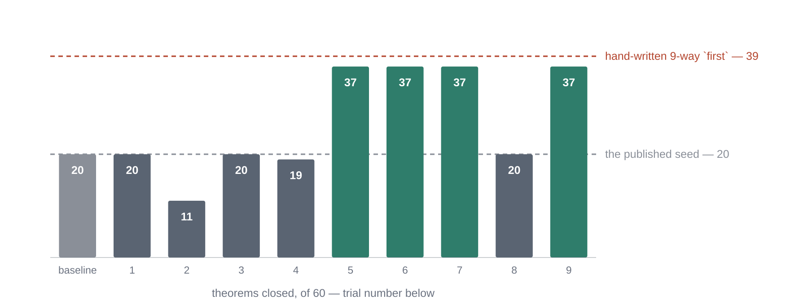
*Ten trials against two reference lines. The search arrives at 37 on trial 5 and never moves again. Trial 8 sampled a parent superseded four trials earlier and came back with the seed's score.*

The evolved answer is 38 lines with a nine-tactic preprocessing chain and 23 alternatives. Mine is nine lines. Every one of my nine tactics is named in `IMPROVE.md`, so the model had every ingredient and assembled something four times longer that closed two fewer theorems.

The failure isn't that the search did badly; 20 to 37 is a real move. It's that the search built complexity that cost it two theorems and **no part of the loop can notice**, because noticing needs a simpler candidate to compare against and no simpler candidate was ever proposed. A metric only ever sees what the model offers. It cannot tell you about the thing the model never offers.

Half the budget bought nothing either: the answer arrives at trial 5, and trials 6, 7 and 9 return 37 again.

One caveat that cuts against my 39 as much as cadence's 37. [*miniF2F-Lean Revisited*](https://arxiv.org/abs/2511.03108) reports discrepancies in more than half of miniF2F's problems, including formal statements that contain the answer the prover is meant to find — trivially closable, and exactly what `omega` and `decide` sweep up. The paper publishes a corrected v2. Re-measuring against it would tell me how much of my number is real. Same shape as the pooled-versus-averaged correction: a benchmark detail that makes a wrong number look right.

## Job Shop Scheduling

The three problems so far all had something wrong with the measuring stick. Circle packing's baseline was mine. Bin packing's L2 is a genuine published bound, but it is a *bound* — zero is unreachable, so you never learn the real gap. Lean's benchmark has documented defects in more than half its problems.

So the last problem was picked for its measuring stick.

A factory has jobs. Each job is a fixed sequence of operations, each needing a particular machine for a known time. A machine does one thing at a time, and an operation waits for the one before it in its own job. When a machine frees up and several operations are waiting, something has to choose. In real plants that something is almost always a one-line priority rule, because anything cleverer does not survive the shop floor.

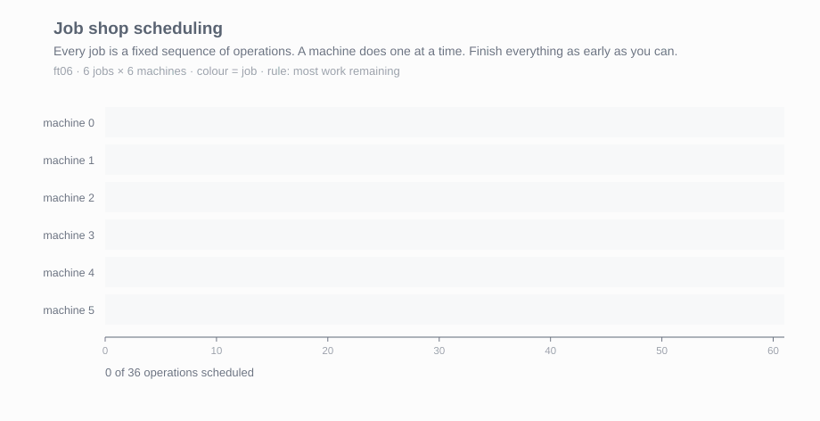
*`ft06`, the smallest classic instance: 6 jobs on 6 machines. Each block is one operation, coloured by the job it belongs to. The red line is the makespan — the moment the last job finishes — and that is the number being minimised. Most work remaining, the standard rule, lands on 61. The proven optimum is 55.*

That priority rule is what cadence evolves, and it has the same shape as bin packing's: one greedy decision, scored by a number. cadence hands it every operation that could start on this machine right now, and it returns one score each. Highest score goes first.

```python
def priority(ops: list[Op], now: int) -> list[float]: ...
```

Each operation arrives with the handful of facts a real dispatcher would have: how long it takes, how much work is left in its job, how many operations remain, and its job's totals for normalising. The seed rule is one line — score each operation by the work left in its job, and start whichever has the most. That is *most work remaining*, and it is the best of the six textbook rules on this data.

### The machine is disposable

This run is also the one that made the scaling story concrete, because it ran in two sittings on two different days and never noticed.

cadence keeps no state in the process. Every fact goes to Postgres as it happens, so the worker is stateless and interchangeable: point a second machine at the same `DATABASE_URL`, hand it the same project files and the same run id, and it carries on mid-experiment. That is the same bargain Kubernetes makes with pods — the compute is cattle, the state lives somewhere that outlives it — and it is why an experiment can span three days on a laptop that gets closed at night.

It also means scaling out needs no new machinery. Two runs started in the same second get distinct ids, write to separate event sequences and never collide, which I checked deliberately. So running twenty experiments in parallel is a bigger machine and a shell loop, not a job queue and a scheduler.

The honest gap: there is no lease or heartbeat yet. A killed run still claims to be `running` forever, and nothing stops two people resuming the same run at once. The columns for it exist and the mechanism does not — which is fine for one person on one laptop and the first thing I would fix before anyone else relies on it.

### The measuring stick is computed, not quoted

The instances are `ft`, `la`, `orb` and `abz` from the same OR-Library that supplied the bin-packing data. The difference is what they are measured against: [OR-Tools](https://developers.google.com/optimization) CP-SAT solves each instance to **proven optimality**, and those answers are written down once and committed. 29 of the 33 held-out instances have a proven optimum; the other four stopped at a bound after sixty seconds and are labelled as such, because "3% above optimal" and "3% above the best bound we could get in a minute" are different claims.

So on this problem, zero means optimal.

It also checks itself before a single model call is spent. CP-SAT returns 55, 930 and 1165 for `ft06`, `ft10` and `ft20` — the three most-quoted optima in the scheduling literature, to the digit. If the parser or the simulator were wrong, those would not match.

The solver never enters the sandbox. It runs once, separately, and writes the optima beside the instances; the scorer and the candidate stay standard-library only. A candidate cannot import a solver and cheat.

### The textbook rules, measured

Six standard dispatching rules, five to ten lines each, run before anything was spent. Excess over the optimal makespan, pooled across 33 held-out instances:

| rule | pooled | `la` (trained shape) | other families |
|---|---|---|---|
| SPT, shortest processing time | 21.49% | 19.94% | 23.36% |
| LPT, longest processing time | 34.41% | 32.91% | 36.24% |
| FIFO ¹ | 29.98% | 29.75% | 30.27% |
| **MWKR, most work remaining** | **17.29%** | 12.95% | 22.56% |
| LWKR, least work remaining | 34.99% | 34.83% | 35.20% |
| MOPNR, most operations remaining | 19.67% | 14.37% | 26.11% |

MWKR is the best simple rule here, which is what the dispatching-rule literature reports, and it is the seed cadence starts from.

The last two columns are the part I care about, and they exist because of what bin packing did to me two days earlier: **improve the validation number, lose the held-out one.**

The `la` instances come in eight groups by size, five each. From every group I put two in training, one in validation and two in the held-out set, so all three sets contain the same mix of sizes. Then `ft`, `orb` and `abz` are held out entirely — those are shapes the search never sees in any form.

So the `la` column asks "did it get better at the sizes it practised on?" and the `other` column asks "did it get better at scheduling?" A rule that gains on the first and loses the second has been tuned, not improved. That failure now has a column of its own, visible from the first run.

### The result

Sixteen trials, gemini-3.6-flash, spread over two days and stopped both times by the daily quota.

| | pooled | `la` (trained shape) | other families |
|---|---|---|---|
| MWKR, the seed | 17.29% | 12.95% | 22.56% |
| **cadence** | **12.20%** | **8.38%** | **16.84%** |

Excess over the proven optimum falls by 5.09 points, which closes 29% of MWKR's remaining gap. Per instance it wins 26 of 33 against the seed, so the average is not carried by a few lucky ones.

And it improves *more* on the families it never saw (−5.72) than on the shape it was tuned on (−4.57). That is the opposite of what bin packing's second lineage did. The check I built after being burned came back clean the first time it was used.

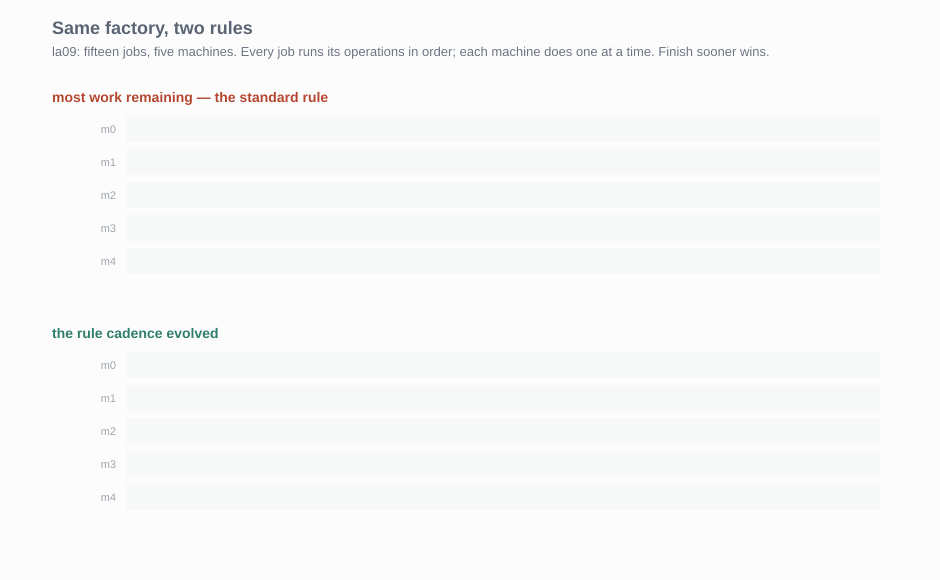
*`la09`, one of the held-out instances: fifteen jobs, five machines, the same factory both times. The standard rule finishes at 1015, the evolved one at 951 — and 951 is the proven optimum, so on this instance it cannot be beaten.*

Verified the same way as the others: the winner, copied into a directory it had never run in, rescores to six decimals.

### What it built, and the term that does nothing

The evolved rule is a weighted sum of ten terms. Most of it is what you would expect — work remaining, the work left after this operation, progress through the job normalised by its length. The interesting part is the end:

```python
- 0.4 * o.duration * (n - 1)
- 0.0012 * o.duration * other_work
```

Both penalise starting a long operation on a machine that other jobs are queuing for. That is exactly what `IMPROVE.md` says MWKR lacks: *"it looks only at the job in front of it and never at the machine it is about to block."* The problem statement pointed at the mechanism again, as it did on bin packing.

One of the ten terms is dead. The rule includes `+ 0.8 * wait`, where `wait` is `now - ready_at` — and under my simulator that is always exactly zero. I checked: 6,836 contests, 13,464 operations, never once non-zero. The model used the term because `IMPROVE.md` told it `now - ready_at` is how long an operation has been waiting, which is false in this implementation.

On bin packing the problem statement handed over a real constraint and the model exploited it. Here it handed over a phantom one, and the model used that too. It does not check; it takes what you tell it.

The same mistake cost me a baseline. My "FIFO" scores `-ready_at`, which is identical for every operation in a contest, so it always falls through to the tie-break and is really "lowest job index first". Measured properly, with `ready_at` meaning when the operation became eligible, FIFO is **23.65%**, not the 29.98% in the table above. MWKR and SPT are unchanged under that correction, which is how I know nothing else moved.

¹ The FIFO row above is the broken one, left as measured. Neither the simulator nor the guidance file is fixed in place, because changing either would make the rest of this run incomparable with its first sixteen trials. Both go in the next lineage.

## What a 4B model on a laptop can and cannot do

Twenty calls a day is the binding constraint in this whole post, so the obvious question is whether a local model removes it. I have `qwen3:4b` and `gemma3:4b` on my laptop. CPU only, integrated graphics, no discrete GPU.

The first thing to check is not how good the model is. It is how much writing each problem needs. My laptop produces about 7.7 tokens a second, and the two problems are nothing alike:

| | tokens out per call | on this laptop |
|---|---|---|
| bin packing | 423 | ~1 minute a trial |
| circle packing | 6,109 | ~13 minutes a **call** |

So circle packing is hopeless on a laptop, and bin packing is fine. Left running overnight, bin packing would do hundreds of trials for free, against Gemini's twenty a day. That is a real option, and it is how I should run the control arm I still owe.

Then I ran it, and got twenty crashes out of twenty trials. Same error every time:

```
IndentationError: unexpected indent   at heuristic.py line 14
```

The model was not the problem. Here is what it produced, verbatim:

```python
scores = []
for bin_capacity in bins:
    scores.append(float(-bin_capacity))
return scores
```

That is best fit, rewritten as a loop. The algorithm is right.

The problem is where it starts. My markers wrapped the *whole function*, `def` line and all. The model returned only the *body*. Paste a body where a function should be, and you get an indented block with nothing above it — hence the error, twenty times.

I assumed a clearer instruction would fix it and added one to the guidance file:

*keep the whole function, including the `def` line.*

Ten more trials, ten more identical crashes. The tokens went up by 290, so the line was in the prompt, and it was ignored.

What actually fixed it was moving the markers inside the function, so the editable region is the body. The very next trial scored.

**Where you put the editable region decides which models can take part at all.** Wrapping the whole function only works if the model works out the unwritten rule by itself. Gemini does, quietly. A 4B model does not. I would never have found this without pointing a small model at it.

One caveat, and it matters. Once it could take part, `gemma3:4b` still never improved anything. Ten trials, four scored, three of them the seed again and one much worse.

So there are two separate walls. The markers were a *can it play* wall, and I knocked that one down. *Is it any good* is a different wall, still standing. A clear problem statement gets a small model into the game. It does not make it win.

`qwen3:4b` could not play at all, and that one is my fault. It is a reasoning model: it thinks first, then answers. Through the endpoint cadence uses, all that thinking goes into one field and the actual answer into another — and cadence only reads the second. So I got 5,028 characters of the model talking itself through a one-line question, and an empty answer. Ollama has a switch to turn the thinking off, and cadence does not know how to flip it. That rules out every local reasoning model until I fix it.

## What the design got right, and what it missed

Four problems and six runs tested both halves.

**What held up.** Resume was hit by a real 503 and a real quota cap, and cost me nothing either time. A verdict that is either a score or a reason — never a number standing in for both — is why an overlapping packing became a zero with an explanation instead of a dead run. Baselines written as code caught a maths error that quoted numbers would have hidden. Keeping the test data above the sandbox root meant I never had to wonder whether a candidate had peeked at it.

**What missed.** Every miss is the same mistake in a different place. **cadence looks at what it is shown, and cannot think about what it was not shown.**

- The cache compares candidates by their text, so one function written three ways looks like three ideas.
- The objective ranks the candidates that arrive. The nine-line answer that would have won the Lean run was never proposed, so nothing could see it.
- The default objective adds up every metric you declare, which quietly rewards a program tuned to its own training data.
- `check` tells you the settings. It does not tell you what they will do. That is why a thirty-second limit read as a fact rather than a ceiling.

Two more turned up in the last two problems.

A candidate that copied the `CADENCE` markers back into its answer triggered an error that cadence treats as *your project being broken*, not *this candidate being broken*. So it ended the whole run after one trial. That is the single reason a small local model cannot finish a run on any problem here, no matter how good its other answers are.

And the database's story of a run drifts from what happened. Resume does not record which settings were used, and spend is counted per session rather than per run, so a resumed run under-reports its own cost.

The spend one has a neat fix, because cadence already solved it once. Every fact is written to a log that is only ever appended to, and the dashboard already gets the right number by adding that log up. The loop just doesn't ask it. It keeps a private counter that restarts at zero on every resume. So there are two answers to "what has this run cost", and the one that decides when to stop is the wrong one.

## Where this leaves cadence, and what I want from you

While I was building this, what I could find from the internet is that three groups published measurements of the same failures on much larger budgets. I found them only while writing this up, which is its own small lesson about reading before building.

Gideoni, Risi and Gal tested code evolution across three domains in [*Simple Baselines are Competitive with Code Evolution*](https://arxiv.org/abs/2602.16805) and found simple baselines matching or beating the sophisticated methods in all three. Their conclusion — that search-space design and the domain knowledge you put in the prompt matter more than the pipeline — is my bin-packing finding in somebody else's words. Herrmann and Pallez reach the same place from the other direction in their [*In-depth Study of LLM Contributions to the Bin Packing Problem*](https://arxiv.org/abs/2510.27353), arguing that contributions to this exact benchmark are overstated and that simpler heuristics can be derived by hand.

The one that unsettled me is Pelleriti et al., [*What Do Evolutionary Coding Agents Evolve?*](https://arxiv.org/abs/2605.20086). Around 30% of added code lines are byte-identical to lines deleted earlier in the same lineage, across every framework they tested. Most final scores arrive by 50–75% of the budget; the rest goes on dead branches. Against my runs: 30% of my calls duplicated, my plateau at trial 5 of 10, my one-minute combinator beating the evolved answer. I should be careful with that first one — they count re-added *lines*, I counted *calls* returning a behaviourally identical program, so the matching number is a coincidence. The direction is not.

Their last finding is the one I would put in front of anyone reporting a single winner: replaying the same prompt almost never reproduces the same program, yet recovers about 76% of the score from a different one. The structural gain survives; the artifact does not. Four trials is not a result, and neither is ten.

The oldest version of this argument is Doug Lenat's [*Why AM and EURISKO Appear to Work*](https://aaai.org/Papers/AAAI/1983/AAAI83-059.pdf), 1983, concluding that his own discovery systems succeeded because of the representation he chose rather than the search running on it.)

From a product point of view, cadence still lacks the polishing touch, but it is a solid foundation for a better system. and this blog proves the system works and generalizes well. A lot of work remains, but this blog is a small fuel to keep going.

So here is what I actually want. [cadence](https://github.com/yash-srivastava19/cadence) is installable. Bring a problem you can score — a heuristic in your own codebase, a routing policy, a scheduler, anything where "better" is a number — and point it at that. Twenty model calls a day was enough to get within 0.155% of a published result on circle packing, so the budget is not the barrier you might expect.

What I would most like back is not a win. It is the run where the number went up and meant nothing, and how you found out. That is the part nobody publishes, and it is the only part that made this post worth writing.

---
